<!-- ────────────────────────────────────────────────────────────────── -->
<!--  shamila@github:~$  profile README                                  -->
<!-- ────────────────────────────────────────────────────────────────── -->

<div align="center">
  
</div>

---

```console
shamila@github:~$ cat about.txt
```
> I like turning fuzzy real-world problems into software.
> Most of my repos are tools I actually wanted to exist — trading back-testers,
> habit & finance trackers, AI chatbots — shipped fast, iterated in public.
> Currently deep in the LLM rabbit hole: retrieval, agents and knowledge graphs.

---

```console
shamila@github:~$ ls -la ~/stack
```

**Languages**


**Frameworks & Libraries**


**Data & AI**


**Tooling**


---

```console
shamila@github:~$ cd projects && ls
```

| project | what it is | stack |
|---|---|---|
| `trade_backtester` | strategy back-testing for FX / trading ideas | TypeScript |
| `risk-monitor` | position & risk monitoring dashboard | Python · TypeScript |
| `trading_ai_chatbot_web` | conversational assistant for trading questions | TypeScript |
| `poc-knowledge-graph` | proof-of-concept knowledge-graph explorer | TypeScript |
| `rag_project_api` | RAG application built for learning | Python |
| `life-tracker` / `habit-tracker` | personal habit & goal tracking apps | TypeScript |
| `money-manager-web` | personal finance manager | TypeScript |

> `git clone` any of them from my [repositories »](https://github.com/Shamilawa?tab=repositories)

---

```console
shamila@github:~$ git log --oneline --stat
```

<div align="center">


</div>

---

```console
shamila@github:~$ ./contact.sh
```

[](https://shamila.netlify.app/)
[](mailto:shamilawasalagedara16@gmail.com)
[](https://www.linkedin.com/in/YOUR-HANDLE)

<!-- TODO: replace YOUR-HANDLE above with your real LinkedIn vanity URL -->

```console
shamila@github:~$ exit
logout

[ thanks for stopping by — go build something ]
```
